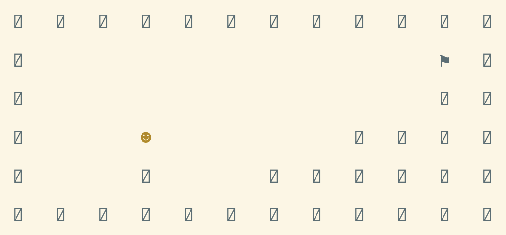
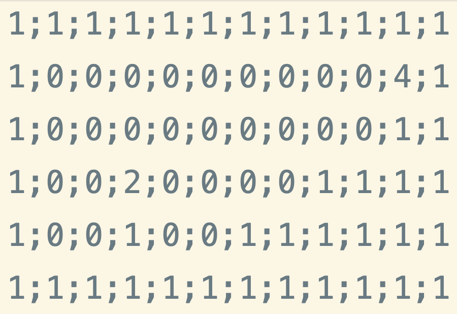

# GeneticAlgorithmGame
GeneticAlgorithmGame is a Java console platformer developed as part of a school project. 
I use a generic algorithm to evolve a creature best fitted for a given level. The course is given
in French, you will find all the details of the application in French.



## Aperçu de l'implémentation
### Paramètres
Lors du lancement de l'application, il faut préciser à l'application au moins 8 arguments (le 8e étant optionnel).
Liste des paramètres :
1. P = nombre de threads qui seront lancés 
2. Width = taille de la grille 
3. Height = hauteur de la grille 
4. C = nombre de créatures ou encore la taille de la population 
5. cross-over rate de ($1-p$) où  $p$ ∈[20%,80%]
6. mutation rate m ∈ [1%,10%]
7. T = le nombre de ticks maximum 
8. grid.csv = fichier représentant la grille

_Note : le 8e paramètre étant optionnel, s'il n'est pas soumis, une grille sera générée automatiquement._
### Grille
#### Avec un huitième argument : grid.csv
Le huitième argument passé en paramètre à l'application est un fichier CSV représentant la grille, la plateforme
du jeu. Le séparateur utilisé est ";". Le contenu du fichier correspond au type de case :
- 0 = une tuile vide
- 1 = un obstacle, un bloc
- 2 = la créature
- 3 = un bord
- 4 = le drapeau, la destination à atteindre
Voici un exemple de fichier grid.csv :

#### Sans huitième argument
Si le dernier argument n'est pas fourni, l'application génère une grille de manière aléatoire.
````java
private void addRandomTiles() {
        for (int x = 0; x < this.height; x++) {
            for (int y = 0; y < this.width; y++) {
                if (x == 0 || y == 0 || x == this.height - 1 || y == this.width - 1) {
                    this.tiles[x][y] = new Obstacle(new Vector2i(x, y), Colors.BLACK);
                } else if (x == 1) {
                    this.tiles[x][y] = new Tile(new Vector2i(x, y), Colors.BLACK);
                } else if (x < this.height / 2) {
                    this.tiles[x][y] = getRandomMiddleTile(x, y, 0.1);
                } else {
                    Tile tile = getRandomMiddleTile(x, y, 0.3);
                    if (x > 2 && this.tiles[x - 1][y] instanceof Obstacle) {
                        this.tiles[x][y] = new Obstacle(new Vector2i(x, y), Colors.BLACK);
                    } else {
                        if (this.tiles[x][y] == null) {
                            this.tiles[x][y] = tile;
                        }
                    }
                }
            }
        }
        addFlag();
        addCreature();
    }
````

### Généricité
Afin d'utiliser l'algorithme génétique pour d'autres applications (exemple : somme de nombre), 2 types génériques
ont été mis en place :
- **G** pour le type de gène (exemple : Character)
- **S** pour le type de la solution (exemple : String)
```java
/**
 * @param <G> type of one gene
 * @param <S> type of the solution
 */
public class GeneticAlgorithm<G, S>
```
### Algorithme génétique
Le design pattern builder a été utilisé 
Avec le design patter builder utilisé, on peut spécifier tous les paramètres nécessaires à l'algorithme :
```java
GeneticAlgorithm<Character, String> algorithm = new GeneticAlgorithmBuilder<Character, String>()
                .populationSize(50)
                .crossoverRate(0.3)
                .mutationRate(0.1)
                .maxIterations(3000)
                .geneSize(solution.length())
                .fitness(fitness)
                .solution(solution)
                .chromosomesBuilder(chromosomeBuilder)
                .selector(new TournamentSelector<>(3, fitness, solution))
                .buildGeneticAlgorithm();
```
_Note : les 5 premiers paramètres ne sont pas nécessaires puisqu'ils possèdent chacun une valeur par défaut_
#### Fitness
Une interface `Fitness` permet de définir la manière de calculer la **fitness** d'un chromosome en implémentant 
la méthode `getFitnessScore(Chromosome<G> chromosome, S solution)` ou (avec Java 8 et +) en utilisant une 
expression lambda. Attention, le calcul de la fitness repose sur la maximalisation. Ainsi, un chromosome avec le score le plus
élevé sera le plus fittest. L'interface définit également 2 méthodes définies par défaut : 
````java
double getFitnessScore(Chromosome<G> chromosome, S solution);
default Chromosome<G> getFittest(Population<G> population, S solution) {...}
default double getFittestScore(Population<G> population, S solution) {...}
````
**Exemple pour les bitString :**
```java
 Fitness<Character, String> fitness = (chromosome, solution) -> {
            int score = 0;
            for (int i = 0; i < chromosome.getNbGenes() && i < solution.length(); i++) {
                if (chromosome.getGene(i) == solution.charAt(i)) {
                    score++;
                }
            }
            int a = chromosome.getNbGenes();
            return (double) score/chromosome.getNbGenes();
        };
```
#### Selector
Une classe mère `Selector` permet de selectionner parmi une population l'individu ayant la meilleure fitness. 
Deux autres classes filles `WheelSelector` et `TournamentSelector` ont été créées et permettent respectivement
de choisir un parent selon le principe de la roulette ou le tournoi.

#### ChromosomeBuilder
Une interface `ChromosomeBuilder` permet de définir la manière de créer un gène pour un chromosome. L'interface 
possède une méthode par défaut pour créer un chromosome avec une liste de gènes.
```java
public interface ChromosomeBuilder<G> {
    default ArrayList<G> buildList(int geneSize) {
        ArrayList<G> list = new ArrayList<>();
        for (int i = 0; i < geneSize; i++) {
            list.add(build());
        }
        return list;
    }
    G build();
}
```
**Exemple pour les bitstring :**
```java
ChromosomeBuilder<Character> chromosomeBuilder = () -> Math.random() < 0.5 ? '0' : '1';
```
### Parallélisation
Dans la classe `WheelSelector`, un pool de threads a été créé afin de calculer les scores de tous les chromosomes :
````java
public void computeAllFitness(Population<G> population) {
        final ExecutorService service = Executors.newFixedThreadPool(this.nThreads);
        for (Chromosome<G> c : population.getChromosomes()) {
            Future<Double> score = service.submit(()->fitness.getFitnessScore(c,solution));
            scores.add(score);
        }
    }
````
Cela permet par la suite de pouvoir calculer la **somme** de toutes les fitness pour la sélection de la roulette.
### Nombre de gènes
L'algorithme suporte également des chromosomes possédant un nombre de gènes différent. Lors de la création de l'algorithme, il suffit de lui préciser un nombre de gènes minimum et un nombre de gènes maximum (si les 2 arguments
sont spécifiés, le nombre de gènes pour chaque chromosome sera un nombre aléatoire choisi entre ces 2 bornes). Exemple : 
````java
algorithm
        .maxGeneSize(15)
        .minGeneSize(10)
        ...
        .buildGeneticAlgorithm();
````
### Platformer
#### Dépendances
Deux dépendances ont été utilisées : 
- [Opencsv](https://opencsv.sourceforge.net) est une librairie qui permet de travailler facilement avec les fichiers CSV.
- [joml](https://github.com/JOML-CI/JOML) une librairie mathématique Java pour les calculs de rendu OpenGL. Celle-ci met à disposition des vecteurs, ce qui permet de définir la position de chaque case du jeu.

Vous retrouverez dans le fichier `pom.xml` les dépendances :
````xml
<dependencies>
        <dependency>
            <groupId>com.opencsv</groupId>
            <artifactId>opencsv</artifactId>
            <version>4.1</version>
        </dependency>
        <dependency>
            <groupId>org.joml</groupId>
            <artifactId>joml</artifactId>
            <version>1.10.4</version>
        </dependency>
    </dependencies>
````